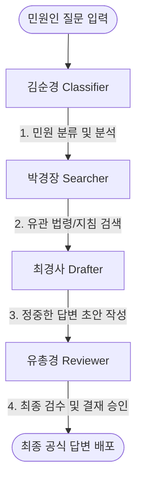

<h1 align="center">
    <a href="https://github.com/pixel-agents-hq/pixel-agents">
        
    </a>
</h1>

<h2 align="center" style="padding-bottom: 20px;">
  👮 경찰서 멀티 에이전트 협업 시스템 (Pixel Agents Police Theme) 👮
</h2>

<div align="center">
  <p>AI 에이전트들의 실시간 협업 과정을 귀여운 픽셀 아트 경찰서 내부에서 실시간 모니터링할 수 있는 비주얼 인터페이스입니다.</p>
</div>

<div align="center" style="margin-top: 20px; margin-bottom: 20px;">

[](LICENSE)
[](https://github.com/pixel-agents-hq/pixel-agents/releases)
[](#시작-가이드)

</div>

<p align="center">
  
</p>

---

## ✨ 경찰서 테마 & 한글화 주요 기능

본 프로젝트는 기존 `pixel-agents`를 대한민국 경찰서 테마로 커스텀하고 완전히 한글화(Localization)하여, 민원 처리 멀티 에이전트 시스템을 시각적으로 구현한 특별 빌드입니다.

1. **👮 전원 대한민국 경찰 제복 개편 (6개 캐릭터 전체)**
   - 픽셀 오피스에 배치될 수 있는 **모든 6개 캐릭터 에셋(`char_0.png` ~ `char_5.png`) 전체**를 대한민국 경찰 컨셉으로 완벽하게 디자인 개편하였습니다.
   - 연하늘색 근무복 상의, 딥 네이비(남색) 근무복 하의, 금색 흉장(배지), 그리고 머리 위에 단정하게 안착된 **경찰 정모(Police Cap)**까지 픽셀 단위로 정밀하게 리드로잉하여 적용했습니다.
   - 캐릭터 스프라이트 도트 데이터의 기하구조를 기반으로 3방향(앞, 뒤, 옆) 및 7프레임 걷기 모션을 자동 변환하는 Python 스크립트(`scripts/generate_police_sprites.py`)를 개발 및 실행했습니다.

2. **🏢 관공서 환경 커스터마이징 (경찰서 인테리어 및 벽면 참수리 액자)**
   - 기존의 밝은 사무실 타일을 차분하고 신뢰감을 주는 **스틸 그레이 및 딥 네이비(Navy/Silver Gray)** 톤의 바닥 레이아웃(`default-layout-1.json`)으로 맵핑했습니다.
   - 벽면에 걸리는 액자 에셋(`LARGE_PAINTING`, `SMALL_PAINTING`, `SMALL_PAINTING_2`)을 **대한민국 경찰 상징 참수리 마크** 및 대한민국 경찰 슬로건 포스터로 교체하여 한층 더 몰입감 넘치는 경찰서 분위기를 구현했습니다.

3. **🇰🇷 100% 한국어 로컬라이징 및 에이전트 계급 매핑**
   - 웹뷰 화면의 모든 메뉴, 설정 모달, 툴바 버튼, 상태 툴팁을 완벽히 **한글**로 패치했습니다.
   - OpenRouter 세션 연동 시 에이전트들에게 친숙한 한국 경찰 계급 이름(**김순경, 박경장, 최경사, 유총경**)과 에이전트별 테마 컬러 팔레트를 할당하였습니다.
   - 에이전트들이 도구를 사용할 때 뜨는 말풍선도 한국어(예: *민원 분석 중...*, *법령/자료 검색 중...*, *답변 초안 작성 중...*, *초안 최종 검수 중...*)로 실시간 출력됩니다.

4. **🔐 철저한 API 키 보안 설정 및 동적 로드**
   - 오픈소스 배포 및 깃허브 제출을 위해 **OpenRouter API Key의 소스코드 내 하드코딩을 완벽히 제거**했습니다.
   - 프로젝트 루트의 `.gitignore`에 `.env*` 패턴이 등록되어 있어, 사용자의 API 키가 작성된 `.env` 파일은 **Git의 추적 및 커밋 대상에서 완전히 제외**되어 외부로 절대 유출되지 않습니다.
   - 실행 시 환경변수(`OPENROUTER_API_KEY`) 또는 `.env` 파일을 자동으로 역추적하여 안전하게 로드하도록 설계하였으며, 키가 없을 시 친절한 한글 안내를 출력하고 비정상 종료를 예방합니다.

---

## 👥 경찰서 에이전트 구성 및 협업 워크플로우

민원을 입력하면 경찰서 소속 4명의 전문 에이전트들이 각자의 책상에 앉아 순차적으로 업무를 수행합니다. (나머지 2명의 경찰관 캐릭터 역시 픽셀 오피스에서 함께 근무복을 입고 상주하며 현장 분위기를 조화롭게 구성합니다.)



- **김순경 (Classifier / char_0)**: 입력된 질문을 형사, 교통, 일반행정, 민원신고 등의 카테고리로 분류합니다. (말풍선: *민원 분석 중...*)
- **박경장 (Searcher / char_1)**: 관련 법규와 지침 규정을 도서관(책 읽기 모션)을 통해 찾아냅니다. (말풍선: *법령/자료 검색 중...*)
- **최경사 (Drafter / char_2)**: 찾아낸 규정을 기반으로 민원인에게 전달할 공식 답변 초안을 타자 모션과 함께 작성합니다. (말풍선: *답변 초안 작성 중...*)
- **유총경 (Reviewer / char_3)**: 답변의 품격과 격식을 검토하고 최종 승인 또는 피드백을 전달합니다. (말풍선: *초안 최종 검수 중...*)

---

## 🚀 시작 가이드 (Quick Start)

### 1. 패키지 설치 및 빌드
우선 레포지토리를 클론한 후 의존성을 설치하고 소스코드를 컴파일합니다.

```bash
# 의존성 패키지 설치 (Workspaces 자동 연동)
npm install

# 전체 프로젝트 빌드 및 컴파일
npm run build
```

### 2. .env 파일 설정
오픈라우터 API 키를 안전하게 보관하기 위해 프로젝트 루트 디렉토리에 `.env` 파일을 생성하고 아래와 같이 키를 입력합니다. (이 파일은 `.gitignore`에 등록되어 있어 외부로 유출되지 않습니다.)

```env
OPENROUTER_API_KEY=your_openrouter_api_key_here
```

### 3. 에이전트 시각화 서버 구동
* **VS Code 확장 프로그램으로 실행하기**:
  VS Code에서 이 프로젝트 폴더를 열고 `F5`를 누르면 에이전트 시각화 창(웹뷰)이 포함된 개발 환경이 실행됩니다.
* **로컬 CLI 서버로 독립 실행하기**:
  VS Code 없이 브라우저 단독으로 실행하고 싶다면 다음 명령을 터미널에 입력합니다:
  ```bash
  node dist/cli.js
  ```
  구동 후 브라우저를 열어 `http://localhost:3100`에 접속하면 귀여운 경찰서 사무실이 나타납니다.

### 4. 멀티 에이전트 워크플로우 실행
새로운 터미널 창을 열고 아래 명령을 실행합니다:

```bash
npx tsx server/src/providers/hook/openrouter/openrouter-agent.ts
```

실행 후 민원 질문을 입력(예: `주차 위반 차량을 신고하고 싶습니다.`)하면 4명의 픽셀 경찰 캐릭터가 바쁘게 움직이며 동작을 실시간으로 시각화합니다!

---

> [!NOTE]  
> 본 프로젝트의 스프라이트는 [JIK-A-4, Metro City](https://jik-a-4.itch.io/metrocity-free-topdown-character-pack) 에셋을 기반으로 경찰 테마에 맞게 2차 창작 및 도트 리드로잉 과정을 거쳐 완성되었습니다.
